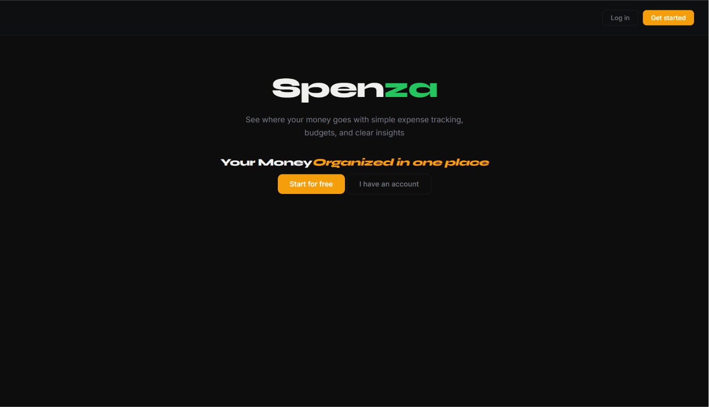
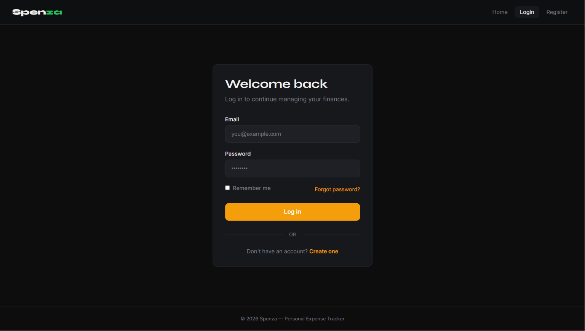
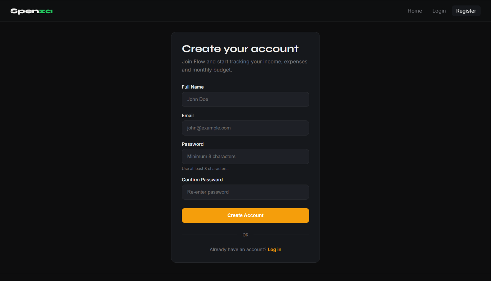
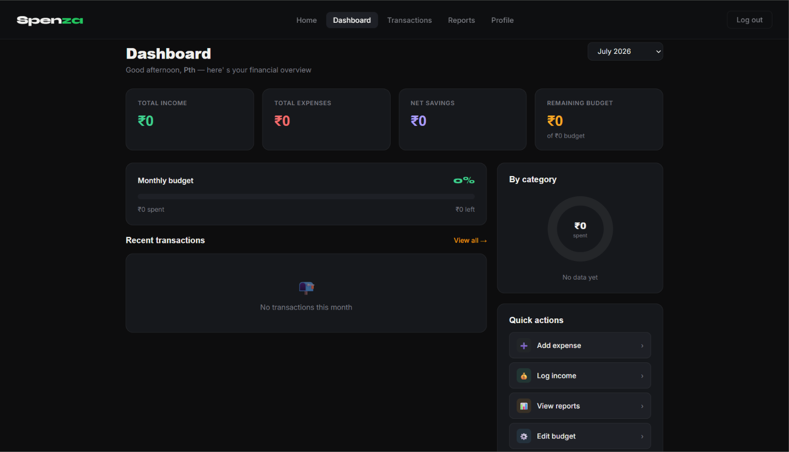
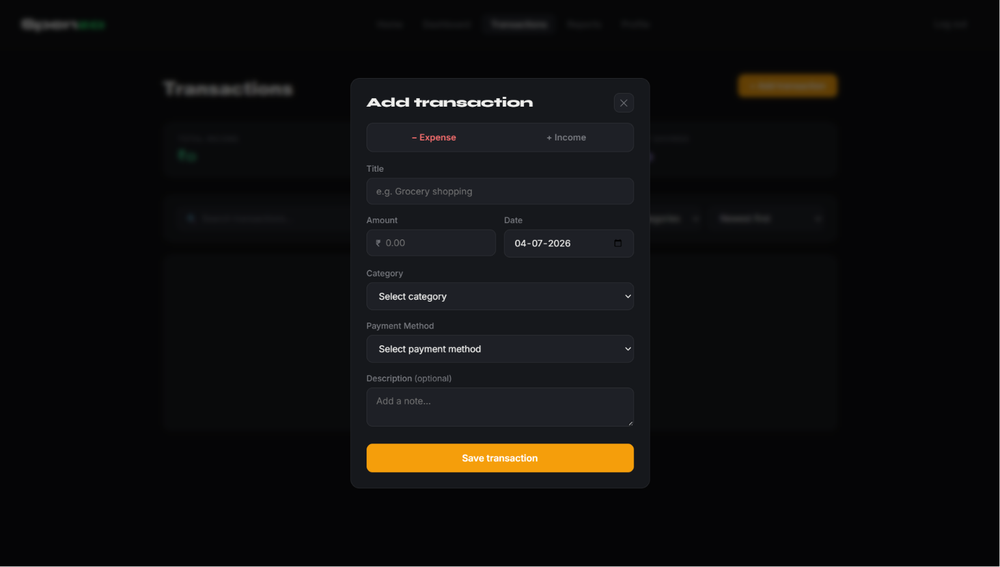
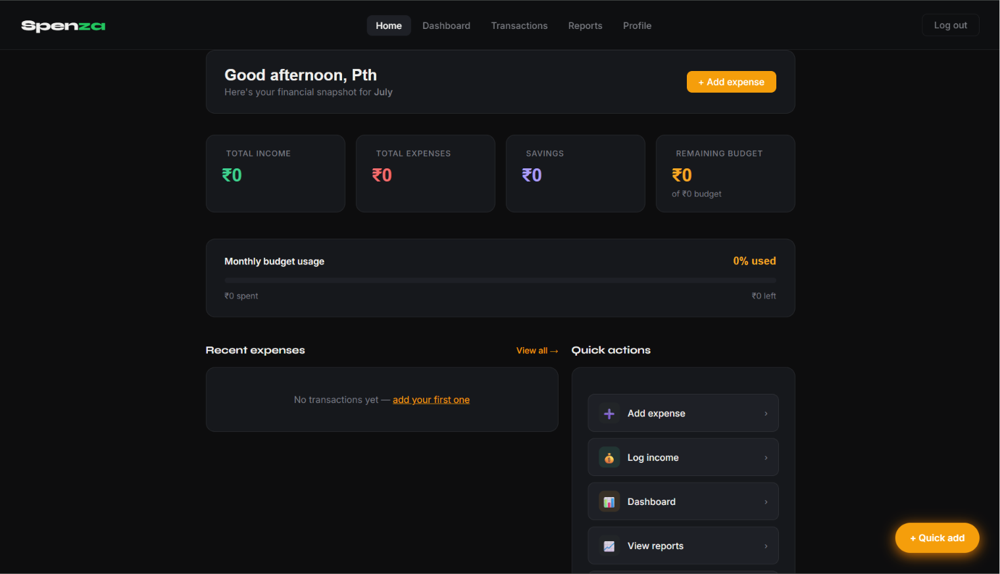
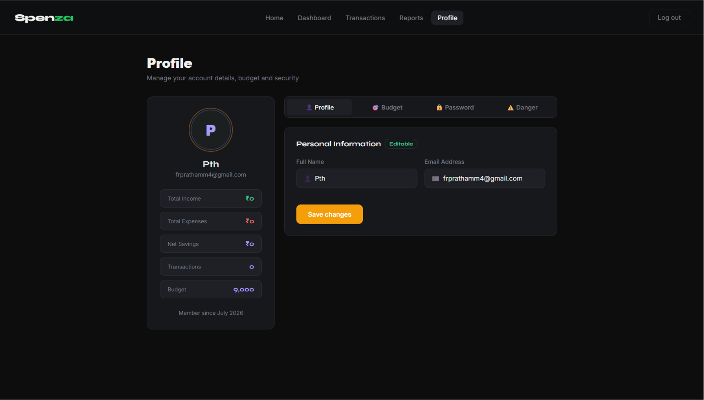

<div align="center">



# 💸 Spenza

### Modern Expense Tracking Web Application

Track your daily expenses, analyze spending habits, and manage your finances with a clean, responsive, and intuitive dashboard.

<p align="center">
    <a href="https://expense-tracker-3ato.onrender.com/">🌐 Live Demo</a> •
    <a href="https://github.com/PTH-15/Spenza">📂 Repository</a>
</p>

<p align="center">


</p>

</div>

---

# 📖 About

**Spenza** is a modern expense tracking web application built to simplify personal finance management.

It enables users to securely manage daily expenses, categorize transactions, choose payment methods, and visualize spending patterns through interactive weekly, monthly, and yearly analytics.

The application focuses on simplicity, speed, and usability while providing meaningful financial insights through a clean user interface.

---

# ✨ Features

## 🔐 Authentication

- Secure User Registration
- Login & Logout
- JWT Authentication
- Password Encryption using bcrypt
- Protected Routes

---

## 💰 Expense Management

- Add Expenses
- Edit Existing Expenses
- Delete Expenses
- Payment Method Support
- Category-wise Expense Organization

---

## 📊 Analytics

- Weekly Expense Overview
- Monthly Expense Overview
- Yearly Expense Overview
- Interactive Bar Charts
- Category-wise Analysis
- Monthly Filters

---

## 📱 User Experience

- Responsive Design
- Clean Dashboard
- Recent Transactions
- User Profile
- Fast Navigation
- Modern UI

---

# 🛠 Tech Stack

## Backend

- Node.js
- Express.js

## Frontend

- EJS
- HTML5
- CSS3
- JavaScript

## Database

- MongoDB Atlas
- Mongoose ODM

## Authentication

- JWT
- bcrypt

---

# 📂 Project Structure

```text
Spenza
│
├── assets/
│
├── models/
│
├── routes/
│
├── views/
│
├── public/
│
├── app.js
│
├── package.json
│
└── README.md
```

---

# 🚀 Getting Started

## Clone Repository

```bash
git clone https://github.com/PTH-15/Spenza.git
```

---

## Navigate

```bash
cd Expense_Tracker
```

---

## Install Dependencies

```bash
npm install
```

---

## Run Locally

```bash
nodemon app.js
```

---

# 📸 Application Preview

## Login



---

## Register



---

## Dashboard



---

## Add Expense



---

## Analytics



---

## Profile



---

# 📈 Future Enhancements

- Export Reports (PDF / CSV)
- Budget Planning
- Expense Reminders
- Income Tracking
- Dark Mode
- Recurring Expenses
- Search & Filters
- Notifications
- Currency Support
- Spending Insights

---

# 🎯 Why Spenza?

✔ Clean & Minimal Interface

✔ Fully Responsive Design

✔ Secure Authentication

✔ Easy Expense Management

✔ Interactive Analytics

✔ Modern Dashboard

✔ Personal Finance Tracking

---

# 👨‍💻 Author

## Prathmesh Naphade (PTH)

Aspiring **Full Stack + AI Engineer**

- GitHub: https://github.com/PTH-15

---

# 🤝 Contributing

This repository is intended for showcasing the project.

Suggestions and feedback are always welcome.

---

# ⭐ Show your support

If you like this project,

⭐ Star this repository.

It helps others discover the project.

---

<div align="center">

### Built by Prathmesh Naphade (PTH)

**Spenza • Track Better • Spend Smarter**

</div>
